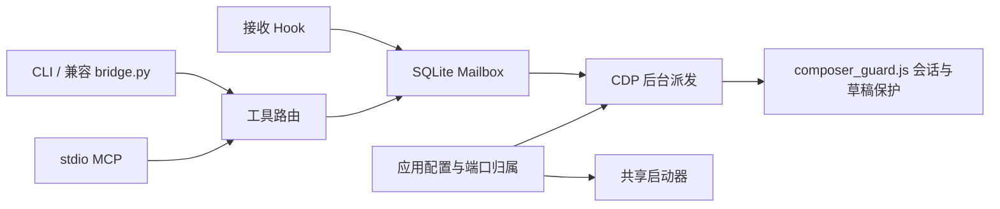

# 开发与验证

此文档说明预览版的架构、开发检查和验证范围。测试不得访问用户业务 mailbox、真实聊天或全局配置。

## 架构



Mailbox 不解析 JSON-RPC，也不负责桌面选取逻辑。协议层不写 SQL。CLI 和 MCP 共用工具路由；启动器与 CDP 共用应用配置和监听进程校验。旧 `bridge.py` 只转发公共 API，以便保留已有脚本和 Hook 导入方式。

SQLite schema、状态名称、工具名称与原有参数保持兼容。MCP 仍使用现有的本地 stdio 协议实现；本轮没有更换 SDK 或迁移协议版本。

CDP 派发阶段依次为：目标与投递日志保护、选择 renderer、校验输入框、输入唤醒、等待就绪、记录 `submit_attempt`、提交、确认输入框清空、记录 `submitted`。其中 `submitted` 仅证明传输事件；实际接收仍由 Hook/ACK/result 证明。

## 修改约定

- Python 使用 88 列 Ruff 格式、明确命名和公开入口类型注解；一次处理一个可验证的职责。
- 修改状态机先看 `mailbox.py` 和收件/回执回归，修改 DOM 先看 `composer_guard.js` 和实际浏览器夹具。
- MCP 的 stdout 只输出 JSON-RPC；其他日志使用 stderr。错误不应让下一条合法请求无法处理。
- 应用路径只放配置文件或应用注册模块，不能在启动脚本再复制一份。
- 不把读取或执行外部任务的权限藏在代码整理里；不使用生产数据库进行单元测试。
- 不把日志、真实会话、私有配置或 Driver 二进制纳入版本控制。

## 检查命令

在仓库根目录，使用已经安装开发依赖的 Python：

```powershell
python -m ruff check .
python -m ruff format --check .
python -m unittest discover -s bridge -p "test_*.py" -q
python -m build --wheel
```

可选实际 DOM 验证需要已安装的 Chrome。夹具当前按 `verify_cdp_fixture.py` 的 `CHROME` 常量定位它；运行前可调整该测试路径。浏览器使用独立临时 profile 和 headless 模式，不使用用户现有浏览器 profile，也不操作真实 Kimi/ZCode 会话：

```powershell
python bridge/verify_cdp_fixture.py
```

夹具结果保存在被 Git 排除的 `bridge/verification/cdp-fixture.json`。原重构验证报告保存在 `bridge/verification/refactor-checks.json`，属于历史证据。自动审批兼容改动的当前报告为 `bridge/verification/auto-approval-checks.json`。

## 本轮验证范围

- 原基线 66 项测试在格式化、模块提取、共享启动配置及 CDP 阶段提取后通过。
- 新增 16 项回归后共 82 项通过，覆盖配置覆盖/拒绝、启动只读与预检中止、端口归属、CMD 错误码、包/旧 CLI 一致、MCP 流隔离、临时 Cua 配置保留和幂等。
- 实际 headless DOM 验证：两种 harness 夹具接收标记；错误会话、已有草稿、附件草稿和忙碌聊天保护通过；采样鼠标与前台窗口保持不变。
- 质量检查与离线 wheel 构建通过；wheel 必须包含 `composer_guard.js`，并用独立临时目录复验导入与 CLI。

两处顺手修复有明确回归：新 CMD 包装器不能吞掉 Python 错误码；副本缺少 `verification/` 时应创建输出目录。另外 Cua 追加函数支持原配置没有 `mcp_servers` 表的情况，不误报修改了其他设置。

未验证：这份副本接入真实 Kimi/ZCode 的往返、实际 Cua 输入、用户桌面重启后的 MCP 加载、生产会话绑定迁移、多项目并发调度。旧安装的成功不能替代这些验证。

## 参考的开源指南

- [Anthropic mcp-builder](https://github.com/anthropics/skills/tree/main/skills/mcp-builder)：本轮使用的已安装 Skill，采用职责分离、共享调用逻辑、类型、stdio 与工具错误处理建议；没有套用新的服务框架。
- [Code Refactoring Skill](https://github.com/MuhiminOsim/code-refactoring-skill)：参考其保留行为、小步修改和测试门禁思路，未安装到全局 Skill 目录。
- [Addy Osmani Code Review and Quality](https://github.com/addyosmani/agent-skills/tree/main/skills/code-review-and-quality)：参考可读性、避免无必要抽象、核对验证证据的审查维度，未安装到全局 Skill 目录。

这些来源是工程参考，不改变用户授权或项目边界。执行记录采用 TASK_EXECUTION、SKILL_DISCOVERY 协议；未委派其他 Agent，也未发布外部仓库。

## 自动审批兼容增量

见 [自动审批说明](codex-approvals.md)。MCP 使用固定的新进程派发，工具路由注入派发函数；CLI 原调用语义保留。`dispatch_background.py --db` 使用 MCP 实际选定的数据库，不误写默认生产数据库。工具行为以准确 annotations 暴露，子进程不接受任意命令或恢复参数。

新增 11 项回归，总数为 93；最小生产补丁另外在源码白名单构成的隔离目录通过原 66 项测试。真实自动审批发送仍需 MCP 加载及许可的测试会话验证。

公开源码默认应用路径已统一为 `Program Files` 示例值；原机器的兼容默认值不属于公开版。WPF 夹具写入可执行文件旁的 `verification/fixture-state.json`，不使用机器专用盘符。

## Harness Courier 命名增量

公共包名、MCP 工具和实现模块已改为 Courier，旧名称保留为兼容入口，见 [命名与兼容性](naming-and-compatibility.md)。新增 11 项命名回归，总计 104 项，覆盖模块身份、角色范围、参数与标注一致、新旧工具混用、原数据库与唤醒协议、环境变量优先级，以及安装器幂等和冲突拒绝。命名验证回执为 `bridge/verification/naming-migration-checks.json`，发布时不包含它。

此轮真实浏览器夹具验证新 `composer_guard.js` 加载路径，独立 wheel 安装验证新旧包与 CLI；Cua WPF 源码只编译，不启动或注入真实桌面输入。真实 Kimi/ZCode 往返、客户端重载和自动审批行为仍未复验。
